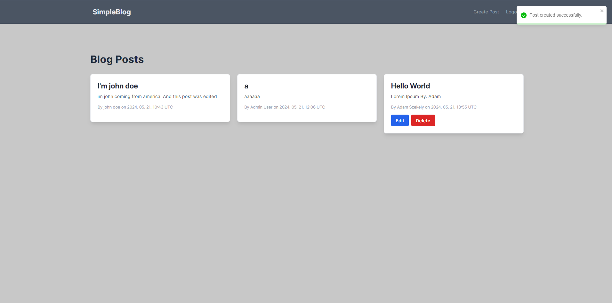

# SimpleBlog

- A blog app built with .NET and NextJs.


## Features

1. **User Authentication**
   - User registration and login functionality
   - Only authenticated users can create, update, or delete posts
   - Unauthenticated users can only view posts
2. **Posting**
    - CRUD operations for blog posts (Create, Read, Update, Delete)
    - Posts stored in a database using MSSQL.

3. **Client**
    - Home page that lists all blog posts.
    - Post detail page to view content of a specific post.
    - Forms for creating and editing posts (only accessible to authenticated users).
   - Login and registration page.

# Running the application.

### **Clone the repository**
```sh
git clone https://github.com/adamchairly/SimpleBlog.git
cd SimpleBlog
```
### Backend

### Initial migration
```sh
cd Backend
dotnet ef database update
```
or in Package Manager Console
```sh
Update-Database
```

Then you can build the solution and that will run the server on localhost:7000

### Frontend
```sh
cd Frontend
npm install
```
then
```sh
npm run dev
```

It will run the client on localhost:3000
